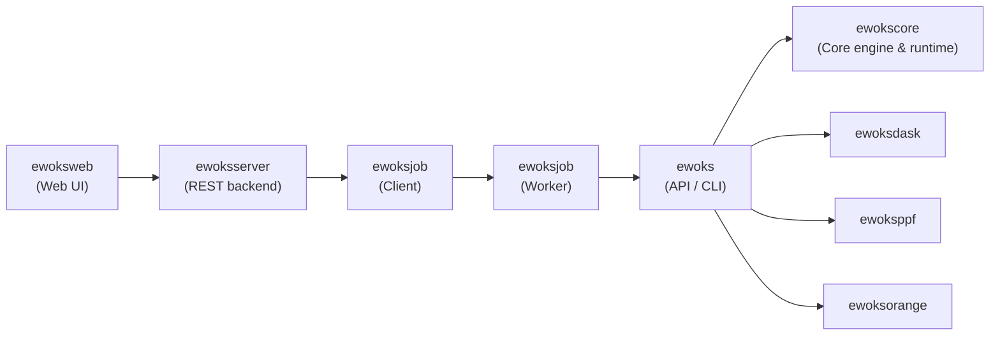

# Extensible Workflow System: Core Projects

[Ewoks](https://ewoks.esrf.fr) is a project to automate data processing and experiments
at large-scale facilities as well as making data processing reproducible and traceable.

It is a _meta workflow system_ that can use different [workflow management systems](https://github.com/common-workflow-language/common-workflow-language/wiki/Existing-Workflow-systems)
to execute the same computation graph.

## Repositories

- `ewoks`: main python API and CLI for workflow execution.
- `ewokscore`: runtime graph and task utilities used by [Ewoks Engines](https://ewoks.esrf.fr/en/latest/engines.html) and [Ewoks Apps](https://ewoks.esrf.fr/en/latest/tasks/index.html).

### Workflow Engines

- `ewokscore`: basic engine for sequential execution.
- `ewoksdask`: engine for distributed execution.
- `ewoksppf`: engine that supports loops and conditional links.
- `ewoksorange`: engine with a desktop graphical user interface.

### Workflow Management

- `ewoksjob`: Job scheduling system
  - _client_: submit workflows (no `ewoks` installation required)
  - _worker_: execute workflows (`ewoks` installed)
- `ewoksutils`: Shared utilities used by ewoks, ewokscore, and ewoksjob on both client and worker sides.
- `ewoksweb`: web frontend for workflow creation and execution.
- `ewoksserver`: REST server for workflow creation and execution.

### Development and Operations

- `ewokssphinx`: Sphinx directives for _Ewoks Apps_ docs.
- `ewokswhale`: Ewoks docker application.
- `ewoksdraw`: Graphical rendering of Ewoks workflows.
