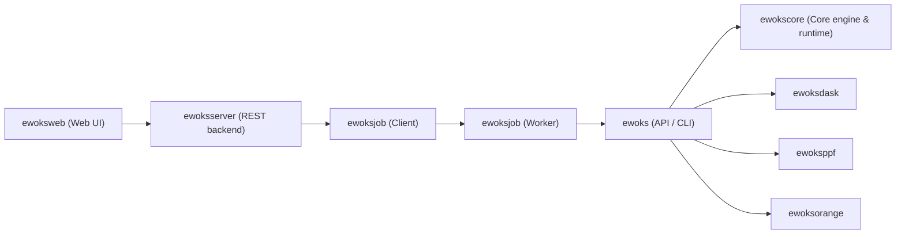

# Extensible Workflow System: Core Projects

[Ewoks](https://ewoks.esrf.fr) is a framework for automating data processing and experiments
at large-scale facilities in a reproducible, traceable, and portable manner.

It is a _meta workflow system_ that can execute the same computation graph using different [workflow management systems](https://github.com/common-workflow-language/common-workflow-language/wiki/Existing-Workflow-systems).

## Repositories

```mermaid
flowchart LR
    ewoksweb["ewoksweb (Web UI)"]
    ewoksserver["ewoksserver (REST backend)"]

    ewoksjob["ewoksjob (Client)"]
    ewoksjobworker["ewoksjob (Worker)"]

    ewoks["ewoks (API / CLI)"]

    ewokscore["ewokscore (Core engine & runtime)"]
    ewoksdask["ewoksdask"]
    ewoksppf["ewoksppf"]
    ewoksorange["ewoksorange"]

    %% User interaction
    ewoksweb --> ewoksserver

    %% Submission path
    ewoksserver --> ewoksjob
    ewoksjob --> ewoksjobworker

    %% Execution
    ewoksjobworker --> ewoks
    ewoks --> ewokscore
    ewoks --> ewoksdask
    ewoks --> ewoksppf
    ewoks --> ewoksorange
```

- [`ewoks`](https://github.com/ewoks-kit/ewoks): main python API and CLI for workflow execution.
- [`ewokscore`](https://github.com/ewoks-kit/ewokscore): runtime graph and task utilities used by [Ewoks Engines](https://ewoks.esrf.fr/en/latest/engines.html) and [Ewoks Apps](https://ewoks.esrf.fr/en/latest/tasks/index.html).

### Workflow Engines

- [`ewokscore`](https://github.com/ewoks-kit/ewokscore): basic engine for sequential execution.
- [`ewoksdask`](https://github.com/ewoks-kit/ewoksdask): engine for distributed execution.
- [`ewoksppf`](https://github.com/ewoks-kit/ewoksppf): engine that supports loops and conditional links.
- [`ewoksorange`](https://github.com/ewoks-kit/ewoksorange): engine with a desktop graphical user interface.

[Engines can be created](https://ewoks.esrf.fr/en/latest/engines.html#adding-a-new-engine-to-ewoks) by anyone.
The `ewoks` package can discover all engines installed in the same python environment.

### Workflow Management

- [`ewoksjob`](https://github.com/ewoks-kit/ewoksjob): Job scheduling system
  - _client_: submit workflows (no `ewoks` installation required)
  - _worker_: execute workflows (`ewoks` installed)
- [`ewoksutils`](https://github.com/ewoks-kit/ewoksutils): Shared utilities used by ewoks, ewokscore, and ewoksjob on both client and worker sides.
- [`ewoksweb`](https://github.com/ewoks-kit/ewoksweb): web frontend for workflow creation and execution.
- [`ewoksserver`](https://github.com/ewoks-kit/ewoksserver): REST server for workflow creation and execution.

### Development and Operations

- [`ewokssphinx`](https://github.com/ewoks-kit/ewokssphinx): Sphinx directives for [Ewoks Apps](https://ewoks.esrf.fr/en/latest/tasks/index.html) documentation.
- [`ewokswhale`](https://github.com/ewoks-kit/ewokswhale): Ewoks docker compose application.
- [`ewoksdraw`](https://github.com/ewoks-kit/ewoksdraw): Graphical rendering of Ewoks workflows.
